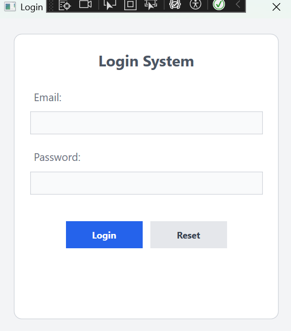
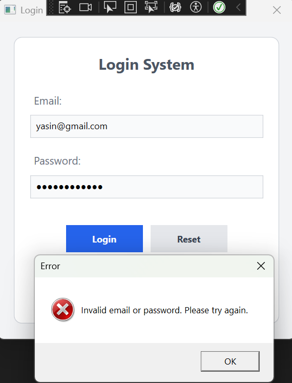
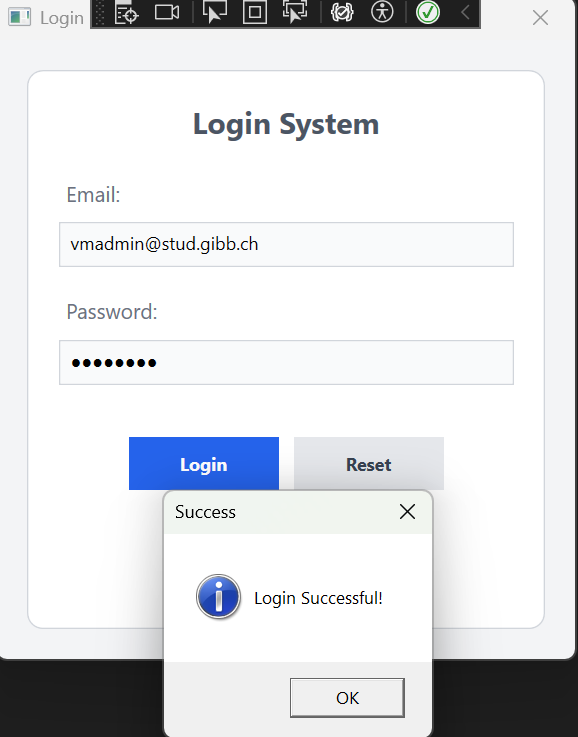

# Login and Password Validation App (WPF) 🔒

## 🚀 Project Overview
This project is a **Login and Password Validation** application built using **WPF (Windows Presentation Foundation)**. The application allows users to log in by entering a **username** and **password**. The credentials are validated against a hardcoded set of credentials (for example, **vmadmin@stud.gibb.ch** as username and **sml12345** as the password).

The app demonstrates how to validate user credentials and provide feedback to the user about whether their login attempt was successful or failed.

---

## 🛠️ Technologies Used
- **C#**: The primary programming language used for this project.
- **WPF (Windows Presentation Foundation)**: The technology used for building the graphical user interface (UI).
- **Hardcoded User Credentials**: For testing purposes, the login functionality uses a hardcoded username and password.

---

## 🌟 Features
- Users can input their **username** and **password**.
- The application **validates the login credentials** against a hardcoded username and password.
- A user-friendly **WPF interface** with clear feedback about successful or failed login attempts.
- Displays a message upon successful login: **"Login Successful!"**.
- Shows an error message if the login credentials are incorrect.

---

## 🔧 Installation and Setup

### 1. Clone the Project
To clone this project to your local machine, use the following command:

git clone https://github.com/your-username/login-password-validation-app.git
                                                                                                                                                                                                                                                                                 
                                                                                                                                                                                                                                                                                 
### 📦 2. Installing Necessary Packages
This project doesn't require any external packages since it's a simple WPF application with hardcoded credentials.

### ▶️ 3. Running the Project
To run the project:

1. Open the project in Visual Studio.
2. Press F5 to start the application.
3. The login window will appear. Enter the username and password.
* Username: vmadmin@stud.gibb.ch
* Password: sml12345
4. Click the "Login" button.
* If the credentials are correct, you will see a "Login Successful!" message.
* If the credentials are incorrect, an error message will be displayed. 

                                                                                                                                                                                                                                                                                 
---

### 📸 Screenshots

- Application Interface
  

- Error Message  
  
  
- After Successful Login
  
                                                                                                                                                                                                                                                                                 
