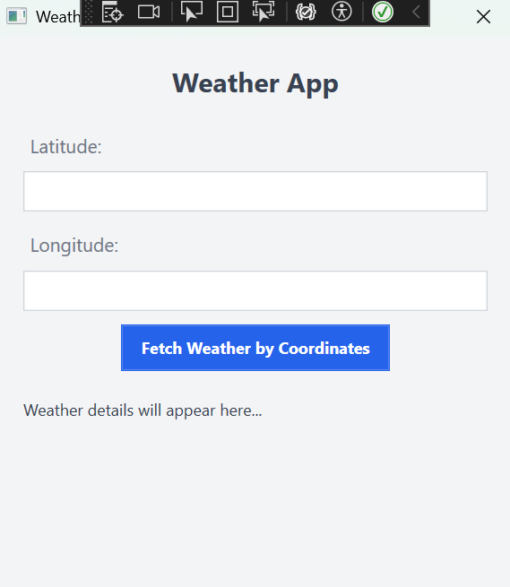
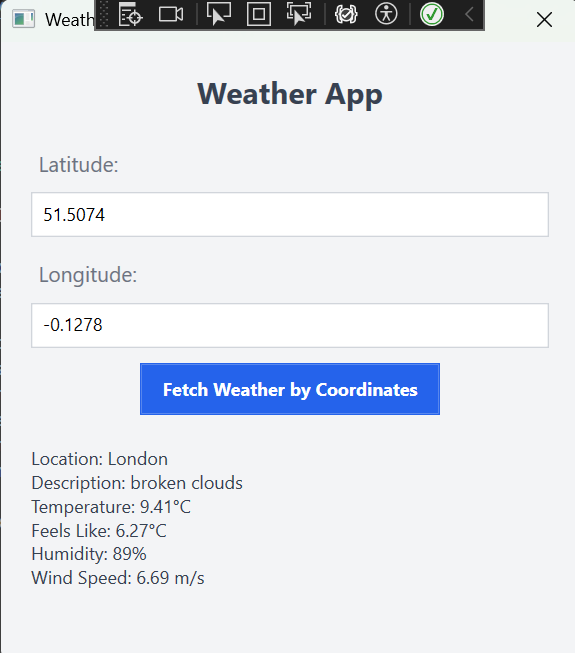

# 🌦️ **Weather App** (WPF - OpenWeatherMap API)

## 🚀 About the Project
This project uses the **OpenWeatherMap API** to provide weather data for a given location. Users can input **latitude** and **longitude** values, and the app will fetch the weather information for those coordinates. 

The app displays key weather details such as temperature, humidity, and wind speed in a user-friendly interface built using **WPF (Windows Presentation Foundation)**.

---

## 🛠️ Technologies Used
- **C#**: The primary programming language used for the app.
- **WPF (Windows Presentation Foundation)**: Used for designing the graphical user interface (GUI).
- **OpenWeatherMap API**: Provides the weather data based on latitude and longitude.
- **Newtonsoft.Json**: A popular library used to parse JSON data from the API response.

---

## 🌟 Features
- Users can directly input **latitude** and **longitude** to get weather data for that specific location.
- The app retrieves weather data from the **OpenWeatherMap API** and displays it, including information like temperature, humidity, and wind speed.
- The data is parsed from **JSON** format and shown in an easy-to-understand format.
- **Error handling**: In case of invalid coordinates or API connection errors, users are shown relevant error messages.

---

## 🏁 Getting Started

### 📦 Prerequisites
Before running the project, make sure you have the following:
- **Visual Studio** or any other C#-compatible IDE
- **.NET Framework 4.5 or later**
- **OpenWeatherMap API key**: You will need a valid API key from [OpenWeatherMap](https://openweathermap.org/api) to fetch weather data.

### 🔧 Installation Steps

  **Clone the Project**:
   ```bash
   git clone <repo_url>

## 🔑 Add Your API Key

To retrieve weather data, you need to add your **OpenWeatherMap API key**.

1. Go to [OpenWeatherMap](https://openweathermap.org/api) and sign up for a free API key.
2. Once you have your API key, open the `MainWindow.xaml.cs` file in your project.
3. Locate the following line in the code:
   ```csharp
   private readonly string apiKey = "YOUR_API_KEY"; // Replace with your OpenWeatherMap API key.

## 📦 Install Newtonsoft.Json

To parse JSON data from the OpenWeatherMap API, you need to install the **Newtonsoft.Json** package.

1. Open **NuGet Package Manager** in Visual Studio:
   - In Visual Studio, go to **Tools > NuGet Package Manager > Manage NuGet Packages for Solution**.
2. Search for `Newtonsoft.Json` in the **Browse** tab.
3. Select the package and click **Install** to add it to your project.

---

## 🏃‍♂️ Run the Project

Follow these steps to build and run the project:

1. Open the project in **Visual Studio**.
2. Build the project by pressing **Ctrl + Shift + B**.
3. Run the project by pressing **F5** or **Ctrl + F5**.

---
## 🖼️ Application Example Screenshot

Here’s an example of how the application should look when you run it:




## 🖥️ User Interface

Once the project is running:

1. Enter valid **Latitude** and **Longitude** coordinates in the respective input fields.
   - For example, you can use coordinates like:
     - **Latitude**: `41.0082`, **Longitude**: `28.9784` (Istanbul)
2. Click the **"Fetch Weather by Coordinates"** button to retrieve and display the weather details for the entered coordinates.

## 🌍 Example Coordinates

Here are some sample coordinates you can use to test the weather data fetching:

- **Istanbul**: Latitude: `41.0082`, Longitude: `28.9784`
- **Ankara**: Latitude: `39.9208`, Longitude: `32.8541`
- **London**: Latitude: `51.5074`, Longitude: `-0.1278`

Feel free to replace these with other coordinates to check weather data for different locations.

---


## 💻 Example Output

When you input valid coordinates, the app will display weather information like this:




