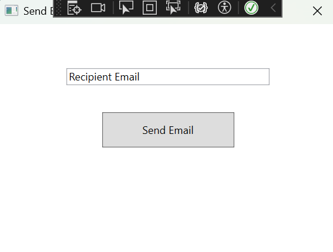
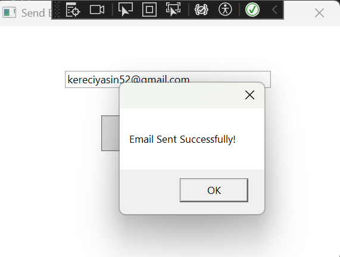
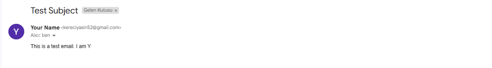

# Send Email App (WPF) ✉️

## 🚀 Project Overview
This project is a simple email sending application developed using **WPF (Windows Presentation Foundation)**. The application allows the user to enter the **recipient's email address** and send an email through the **Gmail SMTP server**.

The email sending functionality is powered by the **MailKit** library. The project also provides a **modern and sleek user interface** built with **WPF**.

---

## 🛠️ Technologies Used
- **C#**: The primary programming language used for this project.
- **WPF (Windows Presentation Foundation)**: The technology used for building the graphical user interface (UI).
- **MailKit**: The library used to send emails via SMTP.
- **Gmail SMTP**: The SMTP server used for sending emails.

---

## 🌟 Features
- Users can input the **recipient's email address**.
- Emails are sent via **Gmail's SMTP server** using the **MailKit** library.
- A modern and sleek **WPF user interface** is provided.
- **Shadows**, **rounded corners**, and a **minimalist design** are used to create an attractive user experience.

---

## 🔧 Installation and Setup

### 1. Clone the Project
To clone this project to your local machine, use the following command:

```bash
git clone https://github.com/your-username/send-email-app.git 
---

##

###  📦 2. Installing Necessary Packages

- To enable email sending functionality, you need to install the MailKit package via NuGet:

- In Visual Studio, go to Tools > NuGet Package Manager > Manage NuGet Packages for Solution.
- Search for the MailKit package and click Install to add it to your project.

---

### ▶️ Running the Project

- To run the project, open it in Visual Studio and press F5 to start the application. When the application opens, input the recipient’s email address and click the "Send Email" button to send an email.

## 📸 Screenshots

### Application Interface


### After Email is Sent


### Email Box


